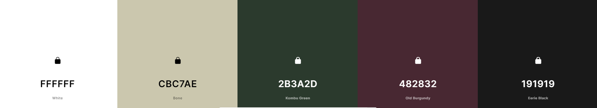
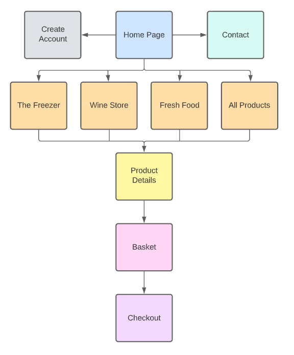
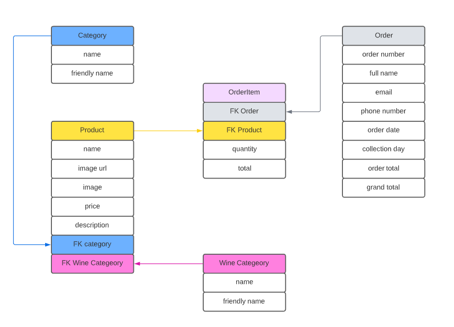

# Swanbourne Village Stores

# Table of Contents
* [Background](#background "Background")
* [Mission Statement](#mission-statement "Mission Statement")
* [Target Audience](#target-audience "Target Audience")
* [Stakeholder Interviews](#stakeholder-interviews "Stakeholder Interviews")
    * [User Persona](#user-persona "User Persona")
    * [User Goals](#user-goals "User Goals")
    * [User Stories](#user-stories "User Stories")
    * [Requirements and Expectations](#requirements-and-expectations)
    * [Strategy](#strategy "Strategy")
        * Strategy Outline
        * Strategy Description

    * [Wireframes](#wireframes "Wireframes")
    * [Design Choices](#design-choices "Design Choices")
        * Fonts
            * Content
            * Headings
        * Colours
        * Images
    * [Structure](#structure "Structure")
        * Site Structure
        * Data Schema
        * Models
        * Forms
    * [Branches](#branches "Branches")
    * [Features](#features "Features")
        * Existing Features
        * Features to be implemented
    * [Technologies used](#technologies-used "Technologies used")
        * Languages
        * Libraries and Frameworks
        * Tools
    * [Testing](#testing "Testing")
        * Accessibility
        * UX Testing
        * Manual Testing
        * Code Validation
        * Bugs
        * Unfixed Bugs
    * [Deployment](#deployment "Deployment")
        * Local Deployment
        * Deployment via Heroku
    * [Credits](#credits "Credits")
    * [My Thoughts](#my-thoughts "My Thoughts")

# Background
Swanbourne Village Stores is a small Post Office and convenience store set in the small village of Swanbourne in Buckinghamshire, England. The store has recently been taken over by Julie and Jean-Claude since the couple returned to the village after living in France for 22 years. 

With business slow to nearly non-existent, and Jean-Claude a trained chef, the idea of a high-end restaurant takeaway service was born over a bottle or two of red wine. This has taken off over the past 9 months with approximately 140 regular weekly customers ordering a three-course takeaway meal along with many one-off meals totalling approximately 450 dishes per week, accompanied by 150 bottles of various wines.

All of the store's business is from word of mouth, there has been no advertisement, only a small amount of promotion via Facebook.

The customer base is 30-year-old professionals to 80 plus-year-old senior citizens, with the bulk of the customers in the 55 plus age groups. The near-complete lack of digital marketing and online presence is what the owners put the fall-off in numbers in the lower age brackets down to.

The current method of dealing with orders is time-consuming and paperwork heavy. On a Monday morning, a menu for the week is emailed out to a mail list of 153 people, no orders are taken via e-mail as mails have been lost in the past leading to customers turning up to pick up an order and it is not prepared. All orders are taken over the phone and manually recorded in an order book along with a collection day, Thursday to Saturday of the same week. When the order has been completed it gets highlighted in the order book in orange and then green on the collection.

The customer also only pays on the collection, leading to potential lost revenue if a meal has been prepared and doesn't get collected. To protect slightly from this, if this situation occurs, the meals are frozen and sold during the following week to walk-in customers of the store.

# Mission Statement
To create an e-commerce application that will enable Swanbourne Village Stores to increase their customer base for their high-end takeaway business and wine store.

# Target Audience
The customers who use Swanbourne Village Stores currently ranges from 30-year-old professionals to 80 plus-year-old senior citizens. However, the owners of the store are looking to increase their 30 to 55 age bracket customers with the convenience of a click, purchase and collect web application, so primarily this is the target audience for the application.

# Stakeholder Interviews

## User Persona
Interviews were carried out with the owners of Swanbourne Village Store, customers that already use the current service and customers of the convenience store that has not yet used the takeaway service.

I managed to get a varied range of ages in the category of customers that do not yet use the service, however, I was unable to interview anyone in the lower age brackets that do use the take-away service.

&nbsp;

| Name | Age | Uses the Service | Meals Ordered per Month
| -- | -- | -- | --
| Julie Blanc | 59 | Owner | N/A
| Jean-Claude Blanc | 62 | Owner | N/A
| Tom Finchett | 52 | Yes | 6
| Frankie Fisher | 73 | Yes | 15
| Ryan Johnston | 57 | Yes | 4
| Julie Timmins | 65 | No | N/A
| Robert Nichols | 50 | No | N/A
| James Tattam | 30 | No | N/A
| Elaine Morris | 33 | No | N/A
| Amanda Parker | 38 | No | N/A

&nbsp;

## User Goals
From the resulting interviews, the user goals have been defined:

1. Create, update and delete fresh dishes, frozen dishes and wines
1. Quickly create orders and securely purchase
1. Book a day for collection
1. Login and out functionality
1. View company contact details
1. See reviews of the business
1. Search through products

&nbsp;

## User Stories

| ID | User Category | User wants to... | So they can... |
|--|--|--|--|
| 01 | Store Owner | Add products | Add new items to the store
| 02 | Store Owner | Edit and update a product | Change the price or any details of a product
| 03 | Store Owner | Delete products | Remove them from the store
| 04 | Store Owner | View all orders | See which are completed and which are outstanding
| 05 | Store Owner | See the number of open orders | Plan their schedule and staff numbers
| 06 | Shopper | View a list of all the products | Choose products to purchase
| 07 | Shopper | See individual product details | Have a detailed explanation of the product
| 08 | Shopper | Have contact information available | Make contact with the store if there is a problem
| 09 | Shopper | Easily select dishes for purchase | Keep interaction time down 
| 10 | Shopper | See the items selected for purchase | Keep track of my selections
| 11 | Shopper | See a running total of shopping basket | Keep track of their spending
| 12 | Shopper | Select multiple quantities of the same product | Order two of the same product
| 13 | Shopper | Filter the products | Narrow down the products to ones wanted
| 14 | Shopper | See the number of search results | See the number of results of the search
| 15 | Site User | Easily register for an account | view an individual profile
| 16 | Site User | Easily login and logout | Access personal information
| 17 | Site User | Recover a password if required | Recover access to their account if required
| 18 | Site User | Have payment information saved | Speed up use for regular customers

&nbsp;

## Requirements and Expectations

| Requirement | Expectation
| -- | --
| Visually appealing and well laid out | Colours to be complimentary, text to be clear. Navigation to be logical and simple
| Responsive design (Mobile first) | The screen size to not affect the look of the application 
| Secure payment method | Card details to be secure
| CRUD functionality for products | Easily maintain the store's products
| Search and filter products | Easily refine the product to the user's needs
 
 &nbsp;

## Strategy
### Strategy Outline
The items are graded in a 0 - 5 system in both importance and feasibility as per the grading system below.

&nbsp;

| | Score - 0 | Score - 3 | Score - 5 |
|--|--|--| -- |
| Importance | Unwise use of time to address | Efforts should be made to accommodate these | Efforts MUST be made to address these
| Feasibility | Unwise use of time to address| Efforts should be made to accommodate these | Efforts MUST be made to address these

&nbsp;

The outcome is calculated by combining the scores from the *Importance* and *Feasibility* ratings. This then gives a final strategy rating of what items and where to focus on.

| | Score - 0 | Score - 5 | Score - 10 |
|--|--|--| -- |
| Item Description | Not viable | Efforts should be made | Efforts MUST be made

&nbsp;

### Strategy Description

| User story ID | Importance Score | Feasibility Score | Outcome |
| --------------- | ----------| -----------| ---------- |
| 1 | 5 | 5 | 10 |
| 2 | 5 | 5 | 10 |
| 3 | 5 | 5 | 10 |
| 4 | 5 | 5 | 10 |
| 5 | 3 | 3 | 6 |
| 6 | 5 | 5 | 10 |
| 7 | 5 | 5 | 10 |
| 8 | 5 | 5 | 10 |
| 9 | 5 | 5 | 10 |
| 10 | 5 | 5 | 10 |
| 11 | 5 | 5 | 10 |
| 12 | 5 | 5 | 10 |
| 13 | 5 | 5 | 10 |
| 14 | 5 | 5 | 10 |
| 15 | 5 | 5 | 10 |
| 16 | 5 | 5 | 10 |
| 17 | 5 | 5 | 10 |
| 18 | 5 | 5 | 10 |

\
&nbsp;
[Back to Top](#table-of-contents)
\
&nbsp;

# Wireframes

[Homepage](readme/docs/wireframes/home-page.png "Homepage")

[Product List](readme/docs/wireframes/products.png "Products")

[Product Description](readme/docs/wireframes/product-description.png "Product Description")

[Contact](readme/docs/wireframes/contact.png "Contact")

[Authentication](readme/docs/wireframes/home-page.png "Authentication")

\
&nbsp;
[Back to Top](#table-of-contents)
\
&nbsp;

## Design Choices

### Fonts

The fonts chosen by the client were both selected from Google Fonts.

* Content - [Jost](https://fonts.google.com/specimen/Jost?category=Sans+Serif&preview.text=Swanbourne%20Village%20Stores&preview.text_type=custom "Jost")

* Headings - [Forum](https://fonts.google.com/specimen/Forum?preview.text=Swanbourne%20Village%20Stores&preview.text_type=custom&query=forum "Forum")

### Colours

Several colour pallets were put to the client, with the only required colour being [white](https://www.color-hex.com/color/ffffff "#FFFFFF") as it was the background colour of the logo.

The final decision was the following.

&nbsp;

&nbsp;

The colours will be used as described in the table below

| Hex Value | Root variable name | Text | Button | Background | Opposite Colour
| -- | -- | -- | -- | -- | --
| #FFFFFF | white | X | X | X | dark-green, purple, black
| #CBC7AE | light-green | X | X | X | dark-green, purple, black
| #2B3A2D | dark-green | X | X | X | white, light-green
| #482832 | purple | X | X | X| white, light-green
| #191919 | black | X | X | X| white, light-green

&nbsp;

All of the desired colour combinations have passed the [WebAIM Contrast Checker](https://webaim.org/resources/contrastchecker/ "WebAIM") and the results can be seen below.

| Colour 1 | Colour 2 | Results
| -- | -- | --
| light-green | purple | [result](readme/docs/designs/lightgreen-purple.png "result")
| light-green | dark-green | [result](readme/docs/designs/lightgreen-green.png "result")
| light-green | black | [result](readme/docs/designs/lightgreen-black.png "result")
| white | purple | [result](readme/docs/designs/white-purple.png "result")
| white | dark-green | [result](readme/docs/designs/white-green.png "result")
| white | black | [result](readme/docs/designs/white-black.png "result")

# Structure
## App Flow

### Guest User

### User

### Admin

## Data Schema

## Models

### Category

| Name | Key | Type | Other Details
| -- | -- | -- | --
| name || CharField | max_length=254, null=False, blank=False
| friendly_name || CharField | max_length=254, null=True, blank=True

### WineCategory

| Name | Key | Type | Other Details
| -- | -- | -- | --
| name || CharField | max_length=254, null=False, blank=False
| friendly_name || CharField | max_length=254, null=True, blank=True

### Product

FROZEN_STATUS = ((0, 'Frozen'), (1, 'Fresh'))

| Name | Key | Type | Other Details
| -- | -- | -- | --
| name | | CharField | max_length=254
| image_url |  |  URLField | max_length=1024, null=True, blank=True
| image |  | ImageField | null=True, blank=True
| price |  | DecimalField | max_digits=6, decimal_places=2
| description | | TextField |
| frozen_item || BooleanField | choices=FROZEN_STATUS, default=1
| category | FK (Category) | | null=True, blank=True, on_delete=models.SET_NULL
| wine_category | FK (WineCategory)| | null=True, blank=True, on_delete=models.SET_NULL

### Order

| Name | Key | Type | Other Details
| -- | -- | -- | --
| order_number | CharField |  URLField | max_length=32, null=False, editable=False
| full_name |  | CharField | max_length=50, null=False, blank=False
| email |  | DecimalField | max_digits=6, decimal_places=2
| phone_number | | CharField | max_length=20, null=False, blank=False
| order_date | | DateTimeField | auto_now_add=True
| collection_day | | CharField | max_length=32, null=False, blank=False
| order_total | | DecimalField |max_digits=10, decimal_places=2, null=False, default=0
| grand_total | | DecimalField |max_digits=10, decimal_places=2, null=False, default=0

### OrderItem

| Name | Key | Type | Other Details
| -- | -- | -- | --
| order | FK (Order) | | null=False, blank=False, on_delete=models.CASCADE, related_name='orderitems'
| product | FK (Product) | | null=False, blank=False, on_delete=models.CASCADE
| quantity |  | IntegerField | null=False, blank=False, default=0
| item_total |  | DecimalField | max_digits=6, decimal_places=2, null=False, blank=False, editable=False

\
&nbsp;
[Back to Top](#table-of-contents)
\
&nbsp;

# Branches

\
&nbsp;
[Back to Top](#table-of-contents)
\
&nbsp;

# Features

## Existing Features

## Features to be Implemented

\
&nbsp;
[Back to Top](#table-of-contents)
\
&nbsp;

# Technologies used

## Languages

## Libraries and Frameworks
| Libraries / Frameworks | Description | Link |
|--|--|--|
[django-mathfilters](https://pypi.org/project/django-mathfilters/)

## Tools
Pillow

# Testing

## Accessibility

\
&nbsp;

### UX Testing

\
&nbsp;
[Back to Top](#table-of-contents)
\
&nbsp;

## Manual Testing

\
&nbsp; 

## Code Validation

### HTML

### CSS

### JS

### Python

\
&nbsp; 

## Bugs

## Unfixed Bugs

\
&nbsp;
[Back to Top](#table-of-contents)
\
&nbsp;

# Deployment

\
&nbsp;
[Back to Top](#table-of-contents)
\
&nbsp;

# Credits
* Code to position the footer at the bottom of the content [radu.link](https://radu.link/make-footer-stay-bottom-page-bootstrap/ "Radu")
* Code for changing animation of dropdown menus [Evochrome](https://stackoverflow.com/questions/34566382/how-to-change-the-animation-of-the-dropdown-menu-in-bootstrap "Evochrome")
* Code for slugifying content [gabrieleromanato](https://jsfiddle.net/gabrieleromanato/RkpYy/ "gabrieleromanato")
* Code for table width styling [stackoverflow](https://stackoverflow.com/questions/928849/setting-table-column-width "stackoverflow")
\
&nbsp;
[Back to Top](#table-of-contents)
\
&nbsp;

# My Thoughts

\
&nbsp;
[Back to Top](#table-of-contents)
\
&nbsp;