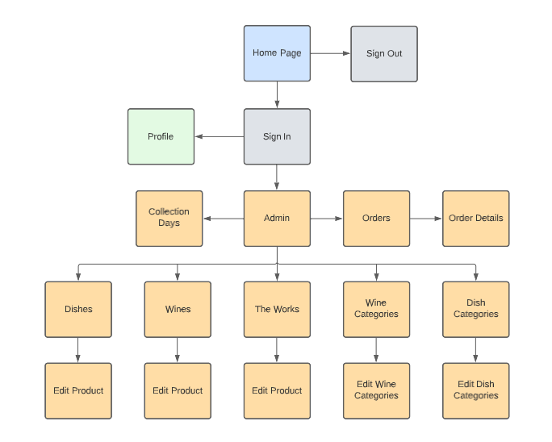
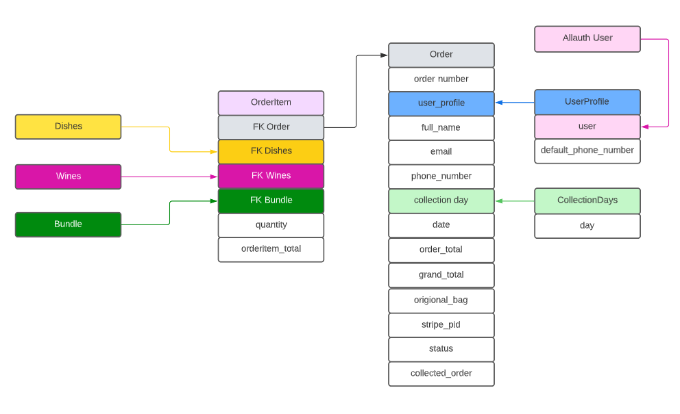
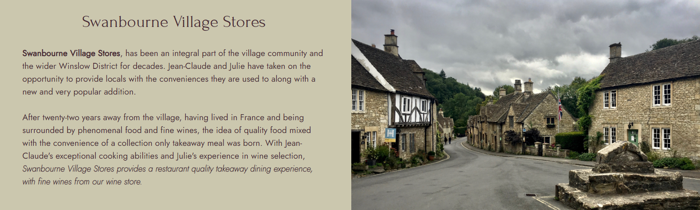
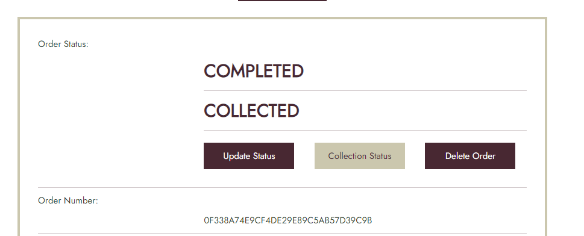

# Swanbourne Village Stores


\
&nbsp;
Live link can be found here - [Swanbourne Village Stores](https://swanbourne-village-stores.herokuapp.com/ "Swanbourne Village Stores")

\
&nbsp;

# Table of Contents
* [Background](#background "Background")
* [Mission Statement](#mission-statement "Mission Statement")
* [Target Audience](#target-audience "Target Audience")
* [Stakeholder Interviews](#stakeholder-interviews "Stakeholder Interviews")
    * [User Persona](#user-persona "User Persona")
    * [User Goals](#user-goals "User Goals")
    * [User Stories](#user-stories "User Stories")
    * [Requirements and Expectations](#requirements-and-expectations)
    * [Strategy](#strategy "Strategy")
        * Strategy Outline
        * Strategy Description
    * [Marketing](#marketing "Marketing")
    * [Wireframes](#wireframes "Wireframes")
    * [Design Choices](#design-choices "Design Choices")
        * Fonts
            * Content
            * Headings
        * Colours
        * Images
    * [Structure](#structure "Structure")
        * Site Structure
        * Data Schema
        * Models
        * Forms
    * [Branches](#branches "Branches")
    * [Features](#features "Features")
        * Existing Features
        * Features to be implemented
    * [Technologies used](#technologies-used "Technologies used")
        * Languages
        * Libraries, Frameworks and Tools
    * [Testing](#testing "Testing")
        * Accessibility
        * UX Testing
        * Manual Testing
        * Code Validation
        * Bugs
        * Unfixed Bugs
    * [Deployment](#deployment "Deployment")
        * Local Deployment
        * Deployment via Heroku
    * [Credits](#credits "Credits")
    * [My Thoughts](#my-thoughts "My Thoughts")

# Background
Swanbourne Village Stores is a small Post Office and convenience store set in the small village of Swanbourne in Buckinghamshire, England. The store has recently been taken over by Julie and Jean-Claude since the couple returned to the village after living in France for 22 years. 

With business slow to nearly non-existent, and Jean-Claude a trained chef, the idea of a high-end restaurant takeaway service was born over a bottle or two of red wine. This has taken off over the past 9 months with approximately 140 regular weekly customers ordering a three-course takeaway meal along with many one-off meals totalling approximately 450 dishes per week, accompanied by 150 bottles of various wines.

All of the store's business is from word of mouth, there has been no advertisement, only a small amount of promotion via Facebook.

The customer base is 30-year-old professionals to 80 plus-year-old senior citizens, with the bulk of the customers in the 55 plus age group. The near-complete lack of digital marketing and online presence is what the owners put the fall-off in numbers in the lower age brackets down to.

The current method of dealing with orders is time-consuming and paperwork heavy. On a Monday morning, a menu for the week is emailed out to a mail list of 153 people, no orders are taken via e-mail as mails have been lost in the past leading to customers turning up to pick up an order and it is not prepared. All orders are taken over the phone and manually recorded in an order book along with a collection day, Thursday to Saturday of the same week. When the order has been completed it gets highlighted in the order book in orange and then green on the collection.

The customer also only pays on the collection, leading to potential lost revenue if a meal has been prepared and doesn't get collected. To protect slightly from this, if this situation occurs, the meals are frozen and sold during the following week to walk-in customers of the store.


# Mission Statement
To create an e-commerce application that will enable Swanbourne Village Stores to increase their customer base for their high-end takeaway business and wine store.

# Target Audience
The customers who use Swanbourne Village Stores currently range from 30-year-old professionals to 80 plus-year-old senior citizens. However, the owners of the store are looking to increase their 30 to 55 age bracket customers with the convenience of a click, purchase and collect web application, so primarily this is the target audience for the application.

# Stakeholder Interviews

## User Persona
Interviews were carried out with the owners of Swanbourne Village Store, customers that already use the current service and customers of the convenience store that has not yet used the takeaway service.

I managed to get a varied range of ages in the category of customers that do not yet use the service, however, I was unable to interview anyone in the lower age brackets that do use the take-away service.

&nbsp;

| Name | Age | Uses the Service | Meals Ordered per Month
| -- | -- | -- | --
| Julie Blanc | 59 | Owner | N/A
| Jean-Claude Blanc | 62 | Owner | N/A
| Tom Finchett | 52 | Yes | 6
| Frankie Fisher | 73 | Yes | 15
| Ryan Johnston | 57 | Yes | 4
| Julie Timmins | 65 | No | N/A
| Robert Nichols | 50 | No | N/A
| James Tattam | 30 | No | N/A
| Elaine Morris | 33 | No | N/A
| Amanda Parker | 38 | No | N/A

&nbsp;

## User Goals
From the resulting interviews, the user goals have been defined:

1. Create, update and delete fresh dishes, frozen dishes and wines
1. Quickly create orders and securely purchase
1. Book a day for collection
1. Login and out functionality
1. View company contact details
1. See reviews of the business
1. Search through products

&nbsp;

## User Stories

| ID | User Category | User wants to... | So they can... |
|--|--|--|--|
| 01 | Store Owner | Add products | Add new items to the store
| 02 | Store Owner | Edit and update a product | Change the price or any details of a product
| 03 | Store Owner | Delete products | Remove them from the store
| 04 | Store Owner | View all orders | See which are completed and which are outstanding
| 05 | Store Owner | See the number of open orders | Plan their schedule and staff numbers
| 06 | Shopper | View a list of all the products | Choose products to purchase
| 07 | Shopper | See individual product details | Have a detailed explanation of the product
| 08 | Shopper | Have contact information available | Make contact with the store if there is a problem
| 09 | Shopper | Easily select dishes for purchase | Keep interaction time down 
| 10 | Shopper | See the items selected for purchase | Keep track of my selections
| 11 | Shopper | See a running total of shopping basket | Keep track of their spending
| 12 | Shopper | Select multiple quantities of the same product | Order two of the same product
| 13 | Shopper | Filter the products | Narrow down the products to the ones wanted
| 14 | Shopper | See the number of search results | See the number of results of the search
| 15 | Site User | Easily register for an account | view an individual profile
| 16 | Site User | Easily login and logout | Access personal information
| 17 | Site User | Recover a password if required | Recover access to their account if required
| 18 | Site User | Have payment information saved | Speed up use for regular customers

&nbsp;

## Requirements and Expectations

| Requirement | Expectation
| -- | --
| Visually appealing and well laid out | Colours to be complimentary, text to be clear. Navigation to be logical and simple
| Responsive design (Mobile first) | The screen size to not affect the look of the application 
| Secure payment method | Card details to be secure
| CRUD functionality for products | Easily maintain the store's products
| Search and filter products | Easily refine the product to the user's needs
 
 &nbsp;

## Strategy
### Strategy Outline
The items are graded in a 0 - 5 system in both importance and feasibility as per the grading system below.

&nbsp;

| | Score - 0 | Score - 3 | Score - 5 |
|--|--|--| -- |
| Importance | Unwise use of time to address | Efforts should be made to accommodate these | Efforts MUST be made to address these
| Feasibility | Unwise use of time to address| Efforts should be made to accommodate these | Efforts MUST be made to address these

&nbsp;

The outcome is calculated by combining the scores from the *Importance* and *Feasibility* ratings. This then gives a final strategy rating of what items and where to focus on.

| | Score - 0 | Score - 5 | Score - 10 |
|--|--|--| -- |
| Item Description | Not viable | Efforts should be made | Efforts MUST be made

&nbsp;

### Strategy Description

| User story ID | Importance Score | Feasibility Score | Outcome |
| --------------- | ----------| -----------| ---------- |
| 1 | 5 | 5 | 10 |
| 2 | 5 | 5 | 10 |
| 3 | 5 | 5 | 10 |
| 4 | 5 | 5 | 10 |
| 5 | 3 | 3 | 6 |
| 6 | 5 | 5 | 10 |
| 7 | 5 | 5 | 10 |
| 8 | 5 | 5 | 10 |
| 9 | 5 | 5 | 10 |
| 10 | 5 | 5 | 10 |
| 11 | 5 | 5 | 10 |
| 12 | 5 | 5 | 10 |
| 13 | 5 | 5 | 10 |
| 14 | 5 | 5 | 10 |
| 15 | 5 | 5 | 10 |
| 16 | 5 | 5 | 10 |
| 17 | 5 | 5 | 10 |
| 18 | 5 | 5 | 10 |


\
&nbsp;
[Back to Top](#table-of-contents)
\
&nbsp;

# Marketing

Facebook is a current marketing strategy carried out by Swanbourne Village Stores. Currently, there is already a page created however it is lacking in a few extra details to improve its performance. Because of this and myself not having access to change it, I have created a dummy page for the store.

The page includes the images from the application for continuity for its home and profile pictures and also has a relevant tag and description as a food service provider. There is also a tab linking to the menu where the owner can add their products.


The offers tab allows for easy advertisement of products within *The Works*


Posts can also be directly published to any followers or promoted via paid promotions.


Finally, the details section allows followers to have thorough details of the store including, location, contact methods, opening times and a brief description of its services.


\
&nbsp;
[Back to Top](#table-of-contents)
\
&nbsp;


# Wireframes

[Homepage](readme/docs/wireframes/home-page.png "Homepage")

[Product List](readme/docs/wireframes/products.png "Products")

[Product Description](readme/docs/wireframes/product-description.png "Product Description")

[Contact](readme/docs/wireframes/contact.png "Contact")

[Authentication](readme/docs/wireframes/home-page.png "Authentication")


\
&nbsp;
[Back to Top](#table-of-contents)
\
&nbsp;


## Design Choices

### Fonts

The fonts chosen by the client were both selected from Google Fonts.

* Content - [Jost](https://fonts.google.com/specimen/Jost?category=Sans+Serif&preview.text=Swanbourne%20Village%20Stores&preview.text_type=custom "Jost")

* Headings - [Forum](https://fonts.google.com/specimen/Forum?preview.text=Swanbourne%20Village%20Stores&preview.text_type=custom&query=forum "Forum")

### Colours

Several colour pallets were put to the client, with the only required colour being [white](https://www.color-hex.com/color/ffffff "#FFFFFF") as it was the background colour of the logo.

The final decision was the following.

&nbsp;


&nbsp;

The colours will be used as described in the table below

| Hex Value | Root variable name | Text | Button | Background | Opposite Colour
| -- | -- | -- | -- | -- | --
| #FFFFFF | white | X | X | X | dark-green, purple, black
| #CBC7AE | light-green | X | X | X | dark-green, purple, black
| #2B3A2D | dark-green | X | X | X | white, light-green
| #482832 | purple | X | X | X| white, light-green
| #191919 | black | X | X | X| white, light-green

&nbsp;

All of the desired colour combinations have passed the [WebAIM Contrast Checker](https://webaim.org/resources/contrastchecker/ "WebAIM") and the results can be seen below.

| Colour 1 | Colour 2 | Results
| -- | -- | --
| light-green | purple | [result](readme/docs/designs/lightgreen-purple.png "result")
| light-green | dark-green | [result](readme/docs/designs/lightgreen-green.png "result")
| light-green | black | [result](readme/docs/designs/lightgreen-black.png "result")
| white | purple | [result](readme/docs/designs/white-purple.png "result")
| white | dark-green | [result](readme/docs/designs/white-green.png "result")
| white | black | [result](readme/docs/designs/white-black.png "result")


# Structure
## App Flow

### Guest User


\
&nbsp;

### Authenticated User


\
&nbsp;

### Admin



## Data Schema

### Products


\
&nbsp;

### Orders


## Models

### DishesCategory

| Name | Key | Type | Other Details
| -- | -- | -- | --
| origin || CharField | max_length=254
| name || CharField | max_length=254
| friendly_name || CharField | max_length=254

\
&nbsp;

### WinesCategory

| Name | Key | Type | Other Details
| -- | -- | -- | --
| origin || CharField | max_length=254
| variety || CharField | max_length=254
| name || CharField | max_length=254
| friendly_name || CharField | max_length=254

\
&nbsp;

### Dishes
```py
DISH_STATUS = ((0, 'Frozen'), (1, 'Fresh'))
```

| Name | Key | Type | Other Details
| -- | -- | -- | --
| category | FK (DishesCategory) | | null=True, blank=True, on_delete=models.SET_NULL
| name | | CharField | max_length=254, unique=True
| slug_name | | SlugField | max_length=254, unique=True
| status | | IntegerField | choices=DISH_STATUS, default=1
| image |  |  CloudinaryField | 'image', default='placeholder, null=True, blank=True
| description | | TextField |
| price |  | DecimalField | max_digits=6, decimal_places=2

\
&nbsp;

### Wines

| Name | Key | Type | Other Details
| -- | -- | -- | --
| category | FK (WinesCategory) | | null=True, blank=True, on_delete=models.SET_NULL
| name | | CharField | max_length=254, unique=True
| slug_name | | SlugField | max_length=254, unique=True
| image |  |  CloudinaryField | 'image', default='placeholder, null=True, blank=True
| description | | TextField |
| price |  | DecimalField | max_digits=6, decimal_places=2

\
&nbsp;

### Bundle

| Name | Key | Type | Other Details
| -- | -- | -- | --
| dish | FK (Dishes) | | null=True, blank=True, on_delete=models.SET_NULL
| wine | FK (Wines) | | null=True, blank=True, on_delete=models.SET_NULL
| name | | CharField | max_length=254, unique=True
| slug_name | | SlugField | max_length=254, unique=True
| price |  | DecimalField | max_digits=6, decimal_places=2

\
&nbsp;

### CollectionDays

| Name | Key | Type | Other Details
| -- | -- | -- | --
| day | | CharField | max_length=9, unique=True, blank=False

\
&nbsp;

### Order

```py
COMPLETED = ((0, 'Open'), (1, 'Complete'))

COLLECTED_ORDER = ((0, 'Not Collected'), (1, 'Collected'))
```


| Name | Key | Type | Other Details
| -- | -- | -- | --
| order_number |  |  CharField | max_length=32, null=False, editable=False
| user_profile | FK(UserProfile) |  | null=True, blank=True, related_name='orders', on_delete=models.SET_NULL
| full_name |  | CharField | max_length=50, null=False, blank=False
| email |  | DecimalField | max_length=254, null=False, blank=False
| phone_number | | CharField | max_length=20, null=False, blank=False
| collection_day | FK(UserProfile) |  | null=True, blank=False, on_delete=models.SET_NULL
| date | | DateTimeField | auto_now_add=True
| order_total | | DecimalField | max_digits=10, decimal_places=2, null=False, default=0
| grand_total | | DecimalField | max_digits=10, decimal_places=2, null=False, default=0
| original_bag | | TextField | null=False, blank=False, default=''
| stripe_pid | | CharField | null=False, blank=False, default=''
| status | | IntegerField | choices=COMPLETED, default=0
| collected_order | | IntegerField | choices=COLLECTED_ORDER, default=0

\
&nbsp;

### OrderItem

| Name | Key | Type | Other Details
| -- | -- | -- | --
| order | FK (Order) | | null=False, blank=False, on_delete=models.CASCADE, related_name='orderitems'
| dish | FK (Dishes) | | null=True, blank=True, on_delete=models.CASCADE
| wine | FK (Wines) | | null=True, blank=True, on_delete=models.CASCADE
| bundle | FK (Bundle) | | null=True, blank=True, on_delete=models.CASCADE
| quantity |  | IntegerField | null=False, blank=False, default=0
| orderitem_total |  | DecimalField | max_digits=6, decimal_places=2, null=False, blank=False, editable=False

\
&nbsp;

### User Profile

| Name | Key | Type | Other Details
| -- | -- | -- | --
| user | FK (User) | | on_delete=models.CASCADE
| default_phone_number | | | max_length=20, null=True, blank=True

\
&nbsp;
[Back to Top](#table-of-contents)
\
&nbsp;


# Branches

Branches were used throughout the project, however, there was the odd occasion where I was a little too eager and accidentally pushed to the main branch. The branches were linked to issues for example adding an active class to the navbar branch can be seen [here](https://github.com/sam-timmins/swanbourne_village_stores/commit/20ee2e56d31a6fff3101dd7bc41c5722405d86d1 "branch")

All stale branches have been deleted from the project, this can be seen [here](https://github.com/sam-timmins/swanbourne_village_stores/branches/all "branches")

\
&nbsp;
[Back to Top](#table-of-contents)
\
&nbsp;


# Features

## Existing Features

### Navbar

The navigation bar is fully responsive to all screen sizes. it includes a search bar that searches the menu and the user's session basket total. The basic view is if a user is not logged in, then there are other differences depending on the user's login access: 

- The user is not logged in, this is the basic view.


- The user is logged in as a standard user, and the profile link is then shown displaying the first letter of the user's username in uppercase.


- The user is logged in as admin, and the profile link is shown along with the admin link. 


### Admin orders tab

For admin users to easily see the status of orders, and their collection status a small tab is accessible. This tab opens up an off-canvas menu with order quantities and quick information. the All orders table footer also acts as a link to the orders page


### Footer

The footer, like the navbar, has different looks depending on if the user is an admin or not. If the user is not admin then the newsletter is displayed, however, if they are admin then it is not. Also, only on the homepage for a cleaner look, instead of having the same links in the contact section and the footer if any of the icons are duplicated, then they are not shown in the footer.

- Standard user


- Admin user


- Homepage


### Homepage
The home page consists of four sections:
- Hero Image, includes simple button navigation to the menu


- About, a brief description of the store



- The Menu, background to the menu and a button navigating to it


- Contact, contact for that emails the store owner. This is set to the store owner's email currently but will be changed when required.


### Menu Pages

The menu pages all follow the same layout, with the menu section header, and search bars that give the user an option to search through the products by popular searches or by the product. Then the products are displayed as cards with the image and details. There are small differences on the cards, if the food product is fresh or frozen, this is displayed, and on a *The Works* product the discount figure is displayed.


* Fresh product


* Frozen product


* The Works


### Basket

The basket when empty informs the user and encourages them to start shopping with links to the various product sections


If the basket has items in it they are displayed below. Here the user has the opportunity to update the quantity of the chosen items, or delete them from the basket. the options are then available to the user to either proceed to the checkout or go back to the menu.


### Checkout 

The checkout page displays a table of the user's basket items and then the billing information form. This includes the required collection day dropdown, the options here are set by admin. The full name, email and phone number and card number fields are all also required. There is also a checkbox option for the user to save their details, however, this is only available to users that are signed up and logged in.


After hitting the purchase button, a spin loader covers the screen until Stripe has processed the payment (only set up for test payments at the minute) and then navigated to the order details page.


The user is then emailed details of their order for their reference.


### Profile

The profile page allows the user, who has the saved details checkbox selected on the checkout page to alter and save their phone number. it also has all the orders associated with the logged-in user and by clicking on the row, it navigated the user to the order details view previously shown.


### Administration

The admin section is the section that I am most pleased with. A simple but effective interface with small additional details to help the user experience.


The layout of each of the pages is the same, except for *collection days* and *orders*, with the form to create the appropriate item, in the example below it is the *Create a dish* form along with a table of each of the items in the query set. Each item then has an *edit* button that navigates to the edit page and a *delete* button that opens up a confirmation modal. Administration cards on the admin page are:
* Orders
* Dishes
* Wines
* The Works
* Dish Categories
* Wine Categories
* Collection Days


* Delete modal


* Edit item


The collection days administration page has far less information on it so the page is cleaned up for a simpler view. The page includes a form to create a day and just simple delete functionality via a modal the same as illustrated above. 


The orders card on the admin page gives the user a quick look at order information similar to the orders off-canvas menu. When navigated to the orders page, a table is displayed with all the orders in the query set. These orders are ordered firstly, if the order is an open order, and then secondly if the order has not been collected. Each row in the table acts as a link to the orders details page where the status and collection status can be adjusted. Also, there is a filters tab on the side of the screen that allows the user to narrow down the table of orders


Order details for the administration page have different editing buttons available depending on the status of the order. Initially, when the order status is set to *open* there are two available buttons, update and delete. The delete opens a modal that looks for confirmation and the *Update status* opens another modal asking to confirm the status update. If the status is changed to *complete* then another button is rendered to the page to update the *collection status*. This button again opens a modal looking for confirmation.

* *Open* order


* Change order status


* Completed order


* Collected order status


* Collected order




* Delete order


\
&nbsp;
[Back to Top](#table-of-contents)
\
&nbsp;

## Features to be Implemented

There are a few ideas that I would like to implement in the future:
* Login via social media account or Google.
* Administration section to change a user to superuser status so the store owners can manage their own staff's login abilities.
* Add tracking for when an order status is changed to completed or collected. The time, data and username would be recorded against it.
* Scroll to the top button to be visible on smaller screens
* Customisable email with images and style instead of plain text.

\
&nbsp;
[Back to Top](#table-of-contents)
\
&nbsp;

# Technologies used

## Languages

| Languages | Link |
|--|--|
|HTML|[HTML](https://en.wikipedia.org/wiki/HTML5 "HTML") 
|CSS|[CSS](https://en.wikipedia.org/wiki/CSS "CSS")
|JavaScript|[JavaScript](https://en.wikipedia.org/wiki/JavaScript "JS")
|jQuery|[jQuery](https://jquery.com/ "jQuery")
|Python|[Python](https://en.wikipedia.org/wiki/Python_(programming_language) "Python")
|Markdown|[Markdown](https://en.wikipedia.org/wiki/Markdown)
 
## Libraries, Frameworks and Tools
| Libraries / Frameworks / Tools| Description | Link |
|--|--|--|
|Django|Database Driven Framework| [django](https://en.wikipedia.org/wiki/Django_(web_framework) "django")|
|gunicorn|HTTP Interface Server|[gunicorn](https://en.wikipedia.org/wiki/Gunicorn "gunicorn")|
|psycopg2| Database adaptor | [psycopg2](https://wiki.postgresql.org/wiki/Psycopg "psycogg2")
|cloudinary |Image management|[cloudinary](https://cloudinary.com/ "cloudinary")|
|django auth|User authentication|[auth](https://docs.djangoproject.com/en/3.2/topics/auth/ "auth")|
|django mathfilters | Any maths within the templates |[django-mathfilters](https://pypi.org/project/django-mathfilters/)
| django crispy forms | Styling forms | [crispy-forms](https://django-crispy-forms.readthedocs.io/en/latest/ "crispy-forms")
|Site mockup| Mockup of site on different screen sizes|[Multi Device Website Mockup Generator](https://techsini.com/multi-mockup/index.php "Mockup Generator")
|Sitemap Generator| Generating the site map|[xml-sitemaps](https://www.xml-sitemaps.com/ "XML-Sitemaps.com")
|HTML Validation| Validating HTML|[w3.org](https://validator.w3.org/ "W3C")
|CSS Validation| Validating CSS|[w3.org](https://jigsaw.w3.org/css-validator/ "W3C")
|JS Validation|Validating JS & jQuery|[jshint](https://jshint.com/ "JSHint")
|PEP8|Validating python|[PEP8](http://pep8online.com/ "PEP8")
| Lucid | Site structure design | [Lucid](https://lucid.co/ "Lucid")
| LOADING.IO | Spin Loader | [loading.io](https://loading.io/ "loading.io")
| Unsplash | Images |[Unsplash](https://unsplash.com/ "Unsplash")
| GitPod | Development environment |[Gitpod](https://www.gitpod.io/ "Gitpod")
| Balsamic | Wireframes |[Balsamic](https://balsamiq.com/wireframes/ "Balsamic")
| Bootstrap | Responsive design |[Bootstrap](https://getbootstrap.com "Bootstrap")
| Font Awesome | Icons |[Font Awesome library](https://fontawesome.com/ "Font Awesome")
| miniwebtool | Secret Key |[Secret Key Generator](https://miniwebtool.com/django-secret-key-generator/ "miniwebtool")
| Colours|Colour pallet| [coolors](https://coolors.co/ "coolors")|
| Google Fonts| Fonts |[Google Fonts](https://fonts.google.com/ "Fonts")|
| WebAIM| Colour contrast checks |[WebAIM](https://webaim.org/resources/contrastchecker/ "WebAIM")|
|Pillow| Image processing tool | [Pillow](https://pillow.readthedocs.io/en/stable/ "Pillow")
|generateprivacypolicy.com|Privacy Policy Generator| [Generate Privacy Policy](https://www.generateprivacypolicy.com/)
|Stripe| online payments| [Stripe](https://stripe.com/en-gb "Stripe")


# Testing

## Accessibility


\
&nbsp;

### UX Testing

| ID |  User wants to... | Issue Number | Comments
|--|--|--| -- |
| 01 | Add products | [Issue #5](https://github.com/sam-timmins/swanbourne_village_stores/issues/5 "Issue #5") | Items can be added as a dish, wine or works via the administration page
| 02 | Edit and update a product | [Issue #6](https://github.com/sam-timmins/swanbourne_village_stores/issues/6 "Issue #6") | All details of a product, dish, wine or works can be edited via the administration page
| 03 | Delete products | [Issue #7](https://github.com/sam-timmins/swanbourne_village_stores/issues/7 "Issue #7") | All products can be deleted from the store via the administration page
| 04 | View all orders | [Issue #8](https://github.com/sam-timmins/swanbourne_village_stores/issues/8 "Issue #8") | Available in the administration page on the orders card and via the off-canvas orders popout.
| 05 | See the number of open orders | [Issue #9](https://github.com/sam-timmins/swanbourne_village_stores/issues/9 "Issue #9") | Available on the administration page on the orders card and via the off-canvas orders popout.
| 06 | View a list of all the products | [Issue #10](https://github.com/sam-timmins/swanbourne_village_stores/issues/10 "Issue #10") | Users can view all the products in the 3 sections, dishes, wines and the works
| 07 | See individual product details | [Issue #11](https://github.com/sam-timmins/swanbourne_village_stores/issues/11 "Issue #11") | Detailed explanations of the product available
| 08 | Have contact information available | [Issue #12](https://github.com/sam-timmins/swanbourne_village_stores/issues/12 "Issue #12") | Social links, contact form, telephone number, email and google maps 
| 09 | Easily select dishes for purchase | [Issue #13](https://github.com/sam-timmins/swanbourne_village_stores/issues/13 "Issue #13") | Two clicks are required to select an item to purchase. 
| 10 | See the items selected for purchase | [Issue #14](https://github.com/sam-timmins/swanbourne_village_stores/issues/14 "Issue #14") | the basket view gives the user ability to view items selected and also 
| 11 | See a running total of shopping basket | [Issue #15](https://github.com/sam-timmins/swanbourne_village_stores/issues/15 "Issue #15") | The basket is visible in the navbar at all times and updated accordingly
| 12 | Select multiple quantities of the same product | [Issue #16](https://github.com/sam-timmins/swanbourne_village_stores/issues/16 "Issue #16") | Ability to do this on the product details page or in the basket
| 13 | Filter the products | [Issue #17](https://github.com/sam-timmins/swanbourne_village_stores/issues/17 "Issue #17") | Multiple filters available on the navbar and in the header of each product collection
| 14 | See the number of search results | [Issue #18](https://github.com/sam-timmins/swanbourne_village_stores/issues/18 "Issue #18") | Search results number available to the user after a search has been carried out
| 15 | Easily register for an account | [Issue #19](https://github.com/sam-timmins/swanbourne_village_stores/issues/19 "Issue #19") |  Register page is available in the navbar to a non logged in user. 
| 16 | Easily login and logout | [Issue #20](https://github.com/sam-timmins/swanbourne_village_stores/issues/20 "Issue #20") | Simple view for logging in and loging out.
| 17 | Recover a password if required | [Issue #21](https://github.com/sam-timmins/swanbourne_village_stores/issues/21 "Issue #21") | Completed using allauth
| 18 | Have payment information saved | [Issue #22](https://github.com/sam-timmins/swanbourne_village_stores/issues/22 "Issue #22") | Save checkbox in the checkout view and update phone number in the profile view

\
&nbsp;
[Back to Top](#table-of-contents)
\
&nbsp;

## Manual Testing

| Issue Number |  Title | Comments 
|--|--|--|
| [Issue #35](https://github.com/sam-timmins/swanbourne_village_stores/issues/35 "Issue #35") | Homepage | Layout changed |
| [Issue #27](https://github.com/sam-timmins/swanbourne_village_stores/issues/27 "Issue #27") | Navbar & Footer | Layout changed | 
| [Issue #64](https://github.com/sam-timmins/swanbourne_village_stores/issues/64 "Issue #64") | Contact Form | Contact form able to be submitted with whitespace |
| [Issue #73](https://github.com/sam-timmins/swanbourne_village_stores/issues/73 "Issue #73") | Contact form error message | Change contact form error message and pre fill form with correct information  |
| [Issue #79](https://github.com/sam-timmins/swanbourne_village_stores/issues/79 "Issue #79") | Delivery functionallity | Customer decided that they did not want the delivery functionallity so the delivery logic was left in but removed from the templates. To keep inline with Code institute's clean code requirement, all delivery code was later removed from the project altogether. |
| [Issue #87](https://github.com/sam-timmins/swanbourne_village_stores/issues/87 "Issue #87") | Table column width | Set table column widths for better visual effect |
| [Issue #92](https://github.com/sam-timmins/swanbourne_village_stores/issues/92 "Issue #92") | Orders table link to detailed order | Change the link to the detailed view from being a button at the end to the whole row |
| [Issue #101](https://github.com/sam-timmins/swanbourne_village_stores/issues/101 "Issue #101") | Open orders tab | Fixed styling issue |
| [Issue #114](https://github.com/sam-timmins/swanbourne_village_stores/issues/114 "Issue #114") | Open orders tab | Fixed text alignment in about section for different screen sizes |
| [Issue #116](https://github.com/sam-timmins/swanbourne_village_stores/issues/116 "Issue #116") | Add to basket toasts | Add toast feedback|
| [Issue #120](https://github.com/sam-timmins/swanbourne_village_stores/issues/120 "Issue #120") | Collected order option | Client requested a option to mark off an order as collected |
| [Issue #131](https://github.com/sam-timmins/swanbourne_village_stores/issues/131 "Issue #131") | Administration | Change administration pages to look the same, form on the left and table on the right |
| [Issue #133](https://github.com/sam-timmins/swanbourne_village_stores/issues/133 "Issue #133") | Form control placeholder colour | Changed colour of placeholder |
| [Issue #135](https://github.com/sam-timmins/swanbourne_village_stores/issues/135 "Issue #135") | Update and Remove in basket | Add icons to the update and remove buttons in the basket |
| [Issue #137](https://github.com/sam-timmins/swanbourne_village_stores/issues/137 "Issue #137") | Checkout collection day | Add clarification text to the collection day field in the checkout page |
| [Issue #138](https://github.com/sam-timmins/swanbourne_village_stores/issues/138 "Issue #138") | Save info checkbox | Change the default to be unchecked |
| [Issue #141](https://github.com/sam-timmins/swanbourne_village_stores/issues/141 "Issue #141") | Cards in admin view | Cards in the admin view were not centered |
| [Issue #143](https://github.com/sam-timmins/swanbourne_village_stores/issues/143 "Issue #143") | Buttons overlapping | Buttons on various scrrens overlapped when the screen size was less that 380px |
| [Issue #145](https://github.com/sam-timmins/swanbourne_village_stores/issues/145 "Issue #145") | Hero image | Hero image was getting mistaken for a pop-up |
| [Issue #147](https://github.com/sam-timmins/swanbourne_village_stores/issues/147 "Issue #147") | Adding to the basket before the document is loaded | User could add to the basket before the toast script was loaded so no feedback was displayed |
| [Issue #151](https://github.com/sam-timmins/swanbourne_village_stores/issues/151 "Issue #151") | Admin layout | Form and table missing space between them on smaller screens |
| [Issue #153](https://github.com/sam-timmins/swanbourne_village_stores/issues/153 "Issue #153") | Side scroll | Side scroll caused by header on various templates |
| [Issue #154](https://github.com/sam-timmins/swanbourne_village_stores/issues/154 "Issue #154") | Admin link | Quick link back to administration page for any page navigated from the daministration cards |
| [Issue #163](https://github.com/sam-timmins/swanbourne_village_stores/issues/163 "Issue #163") | Navbar responsivness | Poor responsivness of navbar on smaller screens |
| [Issue #162](https://github.com/sam-timmins/swanbourne_village_stores/issues/162 "Issue #162") | Active class to the navbar | Add active class to the navbar links |
| [Issue #167](https://github.com/sam-timmins/swanbourne_village_stores/issues/167 "Issue #167") | About image on homepage | Image height changed |
| [Issue #173](https://github.com/sam-timmins/swanbourne_village_stores/issues/173 "Issue #173") | Product cards | Card height is dependent on the image. The height needs to be set to keep the cards a standard size. |
| [Issue #176](https://github.com/sam-timmins/swanbourne_village_stores/issues/176 "Issue #176") | Descriptions on the works detail view | The product descriptions in the works detail view rendered the product name instead of the description |

\
&nbsp; 

## Code Validation

### HTML
| File Name | File Path | Result | W3C | Comments |
|--|--|--|--|--|
| index.html | home/templates/home/index.html | PASS | [link](readme/docs/validation/html/homepage.png "link") ||
| privacy-policy.html | home/templates/home/privacy-policy.html | PASS | [link](readme/docs/validation/html/privacy-policy.png "link") ||
| 400.html | home/templates/home/400.html | PASS | [link](readme/docs/validation/html/400.png "link") ||
| 500.html | home/templates/home/500.html | |  ||
| signup.html | templates/allauth/account/signup.html | PASS | [link](readme/docs/validation/html/signup.png "link") ||
| verification_sent.html | templates/allauth/account/verification_sent.html | PASS | [link](readme/docs/validation/html/verify-email.png "link") ||
| login.html | templates/allauth/account/login.html | PASS | [link](readme/docs/validation/html/login.png "link") ||
| logout.html | templates/allauth/account/logout.html | PASS | [link](readme/docs/validation/html/logout.png "link") ||
| profile.html | profiles/templates/profiles/profiles.html | PASS | [link](readme/docs/validation/html/profiles.png "link") ||
| the-menu.html | products/templates/products/the-menu.html | PASS | [link](readme/docs/validation/html/the-menu.png "link") ||
| fresh-food.html | products/templates/products/fresh-food.html | PASS | [link](readme/docs/validation/html/fresh-food.png "link") ||
| wine-store.html | products/templates/products/wine-store.html | PASS | [link](readme/docs/validation/html/wine-store.png "link") ||
| the-freezer.html | products/templates/products/the-freezer.html | PASS | [link](readme/docs/validation/html/the-freezer.png "link") ||
| the-works.html | products/templates/products/the-works.html | PASS | [link](readme/docs/validation/html/the-works.png "link") ||
| product-details.html | products/templates/products/product-details.html | PASS | [link](readme/docs/validation/html/product-details.png "link") ||
| bag.html | bag/templates/bag/bag.html | PASS | [link](readme/docs/validation/html/basket.png "link") ||
| checkout.html | checkout/templates/checkout/checkout.html | PASS | [link](readme/docs/validation/html/checkout.png "link") ||
| checkout-success.html | checkout/templates/checkout/checkout-success.html | PASS | [link](readme/docs/validation/html/checkout-success.png "link") ||
| orders.html | orders/templates/orders/orders.html | PASS | [link](readme/docs/validation/html/orders.png "link") ||
| order_details.html | orders/templates/orders/order_details.html | PASS | [link](readme/docs/validation/html/order-details.png "link") ||
| administration.html | administration/templates/administration/administration.html | PASS | [link](readme/docs/validation/html/administration.png "link") ||
| dishes.html | administration/templates/administration/dishes.html | PASS | [link](readme/docs/validation/html/admin-dishes.png "link") ||
| wines.html | administration/templates/administration/wines.html | PASS | [link](readme/docs/validation/html/admin-wines.png "link") ||
| works.html | administration/templates/administration/works.html | PASS | [link](readme/docs/validation/html/admin-works.png "link") ||
| dish-categories.html | administration/templates/components/categories/dish-categories.html | PASS | [link](readme/docs/validation/html/admin-dish-categories.png "link") ||
| wine-categories.html | administration/templates/components/categories/wine-categories.html | PASS | [link](readme/docs/validation/html/admin-wine-categories.png "link") ||
| edit-dish-categories.html | administration/templates/components/categories/edit-dish-categories.html | PASS | [link](readme/docs/validation/html/admin-edit-dish-categories.png "link") ||
| edit-wine-categories.html | administration/templates/components/categories/edit-wine-categories.html | PASS | [link](readme/docs/validation/html/admin-edit-wine-categories.png "link") ||
| collection-days.html | administration/templates/administration/collection-days.html | PASS | [link](readme/docs/validation/html/admin-collection-days.png "link") ||


### CSS
| File Name | File Path | Result | W3C | Comments |
|--|--|--|--|--|
| base.css | static/css/base.css | PASS | [link](readme/docs/validation/css/base.png "link") |[5 warnings](readme/docs/validation/css/base-warnings.png "link")|
| administration.css | static/css/administration/administration.css | PASS | [link](readme/docs/validation/css/administration.png "link") | |
| auth.css | static/css/auth/auth.css | PASS | [link](readme/docs/validation/css/auth.png "link") ||
| bag.css | static/css/bag/bag.css | PASS | [link](readme/docs/validation/css/bag.png "link") | [1 warning](readme/docs/validation/css/bag-warnings.png "link")|
| checkout.css | static/css/checkout/checkout.css | PASS | [link](readme/docs/validation/css/checkout.png "link") |[7 warnings](readme/docs/validation/css/checkout-warnings.png "link")|
| home.css | static/css/home/home.css | PASS | [link](readme/docs/validation/css/home.png "link") |[1 warning](readme/docs/validation/css/home-warnings.png "link")|
| media.css | static/css/media/media.css | PASS | [link](readme/docs/validation/css/media.png "link") |[2 warnings](readme/docs/validation/css/media-warnings.png "link")|
| orders.css | static/css/orders/orders.css | PASS | [link](readme/docs/validation/css/orders.png "link") |[5 warnings](readme/docs/validation/css/orders-warnings.png "link")|
| products.css | static/css/products/products.css | PASS | [link](readme/docs/validation/css/products.png "link") |[11 warnings](readme/docs/validation/css/products-warnings.png "link")|


### JS
| File Name | File Path | Result | JSHint | Comments |
|--|--|--|--|--|
| app.js | static/js/app.js | PASS | [link](readme/docs/validation/js/app.png "link") ||
| quantity.js | static/js/bag/quantity.js | PASS | [link](readme/docs/validation/js/quantity.png "link") ||
| checkout.js | static/js/checkout/checkout.js | PASS | [link](readme/docs/validation/js/checkout.png "link") | One undefined variable, this is from the Stripe documentation |
| footer.js | static/js/home/footer.js | PASS | [link](readme/docs/validation/js/footer.png "link") ||
| map.js | static/js/home/map.js | PASS | [link](readme/docs/validation/js/map.png "link") | One undefined and two unused variables, both from Google documentation |
| newsletter.js | static/js/newsletter/newsletter.js | PASS | [link](readme/docs/validation/js/newsletter.png "link") | Two undefined and one unused variables, both from Mailchimp documentation |
| form-slug-field.js | static/js/products/form-slug-field.js | PASS | [link](readme/docs/validation/js/form-slug-field.png "link") ||
| quantity.js | static/js/products/quantity.js | PASS | [link](readme/docs/validation/js/quantity.png "link") ||


### Python
| File Name | File Path | Result | PEP8 | Comments |
|--|--|--|--|--|
| forms.py | administration/forms.py | PASS | [link](readme/docs/validation/python/administration/forms.png "link") ||
| urls.py | administration/urls.py | PASS | [link](readme/docs/validation/python/administration/urls.png "link") ||
| views.py | administration/views.py | PASS | [link](readme/docs/validation/python/administration/views.png "link") ||
| contexts.py | bag/contexts.py | PASS | [link](readme/docs/validation/python/bag/contexts.png "link") ||
| urls.py | bag/urls.py | PASS | [link](readme/docs/validation/python/bag/urls.png "link") ||
| views.py | bag/views.py | PASS | [link](readme/docs/validation/python/bag/views.png "link") ||
| admin.py | checkout/admin.py | PASS | [link](readme/docs/validation/python/checkout/admin.png "link") ||
| forms.py | checkout/forms.py | PASS | [link](readme/docs/validation/python/checkout/forms.png "link") ||
| models.py | checkout/models.py | PASS | [link](readme/docs/validation/python/checkout/models.png "link") ||
| signals.py | checkout/signals.py | PASS | [link](readme/docs/validation/python/checkout/signals.png "link") ||
| urls.py | checkout/urls.py | PASS | [link](readme/docs/validation/python/checkout/urls.png "link") ||
| views.py | checkout/views.py | PASS | [link](readme/docs/validation/python/checkout/views.png "link") ||
| webhook_handler.py | checkout/webhook_handler.py | PASS | [link](readme/docs/validation/python/checkout/webhook_handler.png "link") ||
| webhooks.py | checkout/webhooks.py | PASS | [link](readme/docs/validation/python/checkout/webhooks.png "link") ||
| contexts.py | home/contexts.py | PASS | [link](readme/docs/validation/python/home/contexts.png "link") ||
| urls.py | home/urls.py | PASS | [link](readme/docs/validation/python/home/urls.png "link") ||
| views.py | home/views.py | PASS | [link](readme/docs/validation/python/home/views.png "link") ||
| forms.py | orders/forms.py | PASS | [link](readme/docs/validation/python/orders/forms.png "link") ||
| urls.py | orders/urls.py | PASS | [link](readme/docs/validation/python/orders/urls.png "link") ||
| views.py | orders/views.py | PASS | [link](readme/docs/validation/python/orders/views.png "link") ||
| admin.py | products/admin.py | PASS | [link](readme/docs/validation/python/products/admin.png "link") ||
| models.py | products/models.py | PASS | [link](readme/docs/validation/python/products/models.png "link") ||
| urls.py | products/urls.py | PASS | [link](readme/docs/validation/python/products/urls.png "link") ||
| views.py | products/views.py | PASS | [link](readme/docs/validation/python/products/views.png "link") ||
| widgets.py | products/widgets.py | PASS | [link](readme/docs/validation/python/products/widgets.png "link") ||
| forms.py | profiles/forms.py | PASS | [link](readme/docs/validation/python/profiles/forms.png "link") ||
| models.py | profiles/models.py | PASS | [link](readme/docs/validation/python/profiles/models.png "link") ||
| urls.py | profiles/urls.py | PASS | [link](readme/docs/validation/python/profiles/urls.png "link") ||
| views.py | profiles/views.py | PASS | [link](readme/docs/validation/python/profiles/views.png "link") ||
| settings.py | swanbourne_stores/settings.py | PASS | [link](readme/docs/validation/python/project/settings.png "link") ||
| urls.py | swanbourne_stores/urls.py | PASS | [link](readme/docs/validation/python/project/urls.png "link") ||
 
\
&nbsp; 


## Bugs

| Issue Number |  Title | Comments 
|--|--|--|
| [Issue #26](https://github.com/sam-timmins/swanbourne_village_stores/issues/26 "Issue #26") | Navbar authentication links | Login and register links are stacked when the user is unauthenticated |
| [Issue #61](https://github.com/sam-timmins/swanbourne_village_stores/issues/61 "Issue #61") | Create product form slug error | When there is an error during creating a product, the slug error text shows and throws off the styling.|
| [Issue #51](https://github.com/sam-timmins/swanbourne_village_stores/issues/51 "Issue #51") | Dropdown Menu | The dropdown menu class has a style applied to it giving a max-width. |
| [Issue #110](https://github.com/sam-timmins/swanbourne_village_stores/issues/110 "Issue #110") | Webhooks | Webhooks are not working, getting a 401 error in Stripe |
| [Issue #129](https://github.com/sam-timmins/swanbourne_village_stores/issues/129 "Issue #129") | Edit works link in navbar not working | Edit works link in navbar not working, giving a 500 error |

\
&nbsp;

## Unfixed Bugs

There are two errors that I am getting in the console when inspecting the application through Chrome.


* [Error one](readme/docs/bugs/error.png "error") appears on all pages across the application
* [Error two](readme/docs/bugs/error-checkout.png "error") appears only on the *Checkout* page

\
&nbsp;
[Back to Top](#table-of-contents)
\
&nbsp;

# Deployment

This project was created using GitHub and the code was written using Gitpod. Branches were created and after committing to the branch it was pushed up to the repository. This project is also deployed to Heroku, during its early stages, Heroku deployment was set to *Enable Automatic Deploys*, which meant that every time that the repository was pushed to, Heroku was updated also. However, Heroku encountered a security issue so automatic deployments were no longer available so the following deployment procedure was followed in the workspace terminal.

```
heroku login -i

Email: __enter_heroku_account_email__
Password: __enter_heroku_account_password__

heroku git:remote -a __your _heroku_app_name__

git push heroku main
```

The live link to the application can be found [here](https://swanbourne-village-stores.herokuapp.com/ "Link")

## Local Deployment

As Gitpod was the IDE that was used to create the project, the following local deployment steps are specific to Gitpod.


### Cloudinary
* Visit Cloudinary by following this [link](https://cloudinary.com/ "Link")
* Click on the *Sign Up For Free* button
* When the account is created, you should see the *API Environment variable*, we will need this for a later process.


### GitHub
* Visit Github by following this [link](https://github.com/ "Link")
* Create an account or log in

#### Forking
* Navigate to the repository by following this [link](https://github.com/sam-timmins/swanbourne_village_stores "Link")
* Click on the *Fork* button in the top right of the screen

#### GitHub Desktop
* Navigate to the repository by following this [link](https://github.com/sam-timmins/swanbourne_village_stores "Link")
* Click on the *Code* button above the file list
* Select *Open with GitHub Desktop*

### Set up your Workspace
When you have your version of the original repository,

* In the terminal run
```
pip3 install -r requirements.txt
```
* In the root directory create a file called **env.py** and add the following content, the content of these, must match the Config Vars in the Heroku deployment section

```py
import os

os.environ['DATABASE_URL'] = "FROM HEROKU DEPLOYMENT SECTION, DATABASE_URL CONFIG VAR"
os.environ['SECRET_KEY'] = "FROM HEROKU DEPLOYMENT SECTION SECRET_KEY CONFIG VAR"
os.environ['CLOUDINARY_URL'] = "API ENVIRONMENT VARIABLE REMOVE 'CLOUDINARY_URL=' FROM BEGINING"
os.environ['DEVELOP'] = '1'

```

* Add the env.py file to the .gitignore file to ensure that its contents are not made public

* Migrate the database models with the following command in the terminal
```
python3 manage.py migrate
```

* Create a superuser and set up the credentials with the following command
```
python3 manage.py createsuperuser
```

* Run the application locally with the command
```
python3 manage.py runserver
```

* To access the admin page using the superuser details just created, add /admin to the end of the URL.

### Deployment via Heroku
* Visit [heroku.com](https://www.heroku.com/home "Heroku")
* Create a new account or sign in
* From the dashboard, select **New** and then **Create new app**
* Enter an individual app name into the text box, select a region from the dropdown and then press **Create app**
* A Heroku app has now been created and the **Deploy** tab is opened. 
* Open the *Resources* tab and in the search bar for *Add-ons* type *Postgres*
* Select *Heroku Postgres*, on the popup, ensure the dropdown is set to *Hobby Dev - Free* and then *Submit Order Form*
* Open the *Settings* tab and then click on the *Reveal Config Vars* button and the database_url should be populated.
* Fill out the rest of the config vars with the content of the table below by filling out the *Key* and *Value* and clicking on *Add* for each entry 

| Key | Value |
| --- | --- |
| CLOUDINARY_URL | URL from Cloudinary
| SECRET_KEY | Secret Key generated from [here](https://miniwebtool.com/django-secret-key-generator/ "Shhh...")
| EMAIL_HOST_PASS | Password from Gmail authentication setup
| EMAIL_HOST_USER | Gmail account that will be used
| STRIPE_PUBLIC_KEY | From the stripe section
| STRIPE_SECRET_KEY | From the stripe section
| STRIPE_WH_SECRET | From the stripe section

* In the buildpacks section of the settings tab, click on **Add Buildpack**, select **python** and then save changes
* Open the **Deploy** tab
* In the deployment method section, select **GitHub** and confirm the connection.
* Enter the repo name into the text box and click **Search**. When the correct repo appears below, click **Connect**
* Return to the Gitpod workspace and in the root directory create a file called *Procfile*
* In the *Procfile* enter the following line including your project name
```
web: gunicorn YOUR_PROJECT_NAME.wsgi
```
* Add and commit to GitHub
```
git add .
git commit -m "commit message goes here"
git push
```
* Add your Heroku app URL to ALLOWED_HOSTS in your settings.py file
```py
ALLOWED_HOSTS = ['YOUR_PROJECT_NAME.herokuapp.com', 'localhost']
```
* Return to Heroku
* In the Automatic deploys section, click **Enable Automatic Deploys**. This updates every time GitHub code is pushed
* To complete the process click on the **Deploy Brach** button in the Manual deploy section, this will take a few seconds to complete while Heroku builds the app
* A message will appear informing you that the app was successfully deployed and a **View** button will bring you to the live site


### Stripe
* Visit Stripe by following this [link](https://dashboard.stripe.com/register "Stirpe")
* And register for an account, for this project as it is only set up for test payments the *activate payments* section can be skipped.
* From the dashboard, click on the *Developers* and then on the lefthand side, *Webhooks*.
* Click on the *Add endpoint button* and paste in the Heroku URL with `/checkout/wh/` included on the end, for example, this project would be `https://swanbourne-village-stores.herokuapp.com/checkout/wh/`
* Add an optional description if required
* Click the *Select events* button and mark the checkbox for *Select all events*, then click *
Add events*.
* Scroll to the very bottom of the page and then click *Add endpoint*
* From the webhook page under the URL, reveal the Signing secret, this will need to be added to Heroku config vars as STRIPE_WH_SECRET.
* Still in the developer's section of Stripe, click on the *API keys* link on the left, the *Publishable key* (STRIPE_PUBLIC_KEY) and *Secret key* (STRIPE_SECRET_KEY) will also be needed to be added to Heroku config vars.

### Email setup
This project is using Gmail as its email provider. Other providers can be used but the setup will differ slightly.

* Create a Gmail account, or log in if you already have an account
* At the top right waffle menu select *Account*, then on the left of the screen select *Security*
* In the *Signing into Google* section turn on 2-step verification and then click *Get started*
* Enter your password and select a verification method
* Go back to the security page and under the 2-step verification there is a new option called *App passwords*, click it.
* In the select app dropdown, select *Mail*
* In the select device dropdown, select *Other* and type in *Django*
* The app password will be shown, copy this and add it to the Heroku config vars as EMAIL_HOST_PASS.

\
&nbsp;
[Back to Top](#table-of-contents)
\
&nbsp;

# Credits
* Code to position the footer at the bottom of the content [radu.link](https://radu.link/make-footer-stay-bottom-page-bootstrap/ "Radu")
* Code for slugifying content [gabrieleromanato](https://jsfiddle.net/gabrieleromanato/RkpYy/ "gabrieleromanato")
* Code for table width styling [stackoverflow](https://stackoverflow.com/questions/928849/setting-table-column-width "stackoverflow")

* [Code Institute](https://codeinstitute.net/all-access-coding-challenge/?gclsrc=aw.ds&&msclkid=1915e48bf28d11888d1785dfd2b04125&utm_source=bing&utm_medium=cpc&utm_campaign=a%26c_SEA_IRL_BR_Brand_Code_Institute&utm_term=code%20institute&utm_content=exa_Brand "CI") for the template
* [Code Institute's Boutique Ado](https://github.com/Code-Institute-Solutions/boutique_ado_v1/) for Stripe payments and guidance
* [Simen Daehlin](https://github.com/Eventyret "Simen Daehlin") for advice and direction and continual support
* [CodingEntrepreneurs](https://www.youtube.com/channel/UCWEHue8kksIaktO8KTTN_zg "CodingEntrepreneurs") for help on Django and testing
* [Codemy.com](https://www.youtube.com/channel/UCFB0dxMudkws1q8w5NJEAmw "Codemy.com") for help on Django
* For gentle helping nudges, the Code Institute tutors
* For testing and feedback, my 'testing focus group' (they know who they are!)

\
&nbsp;
[Back to Top](#table-of-contents)
\
&nbsp;

# My Thoughts


\
&nbsp;
[Back to Top](#table-of-contents)
\
&nbsp;